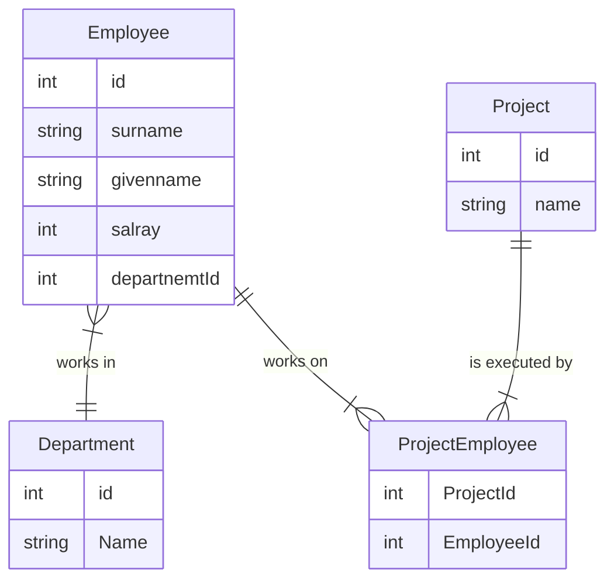

```mermaid
erDiagram
    Employee {
        int id
        string surname
        string givenname
        int salray
        int departnemtId
    }
    Department {
        int id
        string Name
    }
    Project {
        int id
        string name
    }
    ProjectEmployee {
        int ProjectId
        int EmployeeId
    }
    Employee }|--|| Department : "works in"
    Employee ||--|{ ProjectEmployee : "works on"
    Project ||--|{ ProjectEmployee : "is executed by"
```