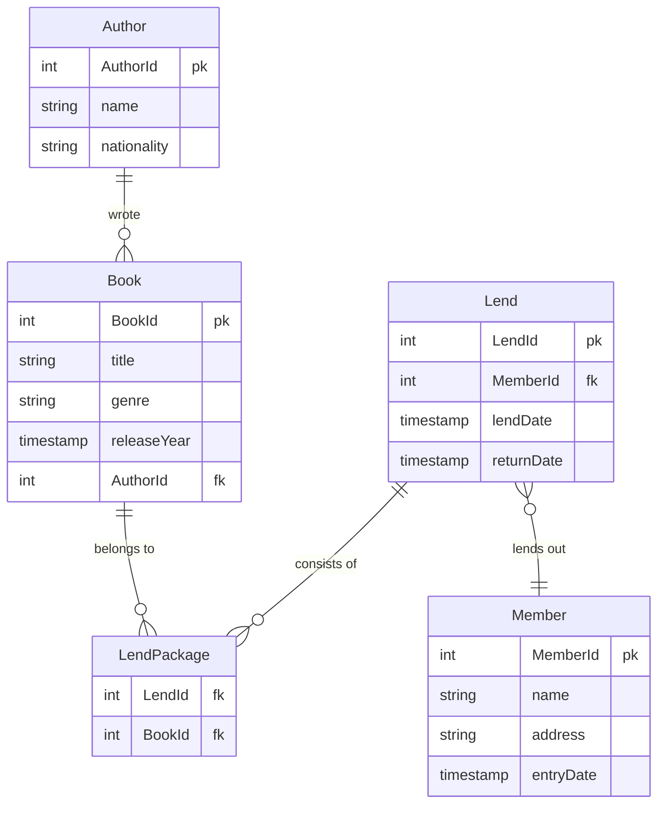

## Bibliotheksstruktur in 2NF
##### von Machal, Ibesich und Braunstingl

```mermaid
erDiagram
    Book {
        int BookId pk
        string title
        string genre
        timestamp releaseYear
        int AuthorId fk
    }
    Author {
        int AuthorId pk
        string name
        string nationality
    }
    Member {
        int MemberId pk
        string name
        string address
        timestamp entryDate
    }
    Lend {
        int LendId pk
        int MemberId fk 
        timestamp lendDate
        timestamp returnDate
    }

    LendPackage {
        int LendId fk
        int BookId fk
    }

    Author ||--o{ Book : "wrote"
    Book ||--o{ LendPackage : "belongs to"
    Lend ||--o{ LendPackage : "consists of"
    Lend }o--|| Member : "lends out"

```