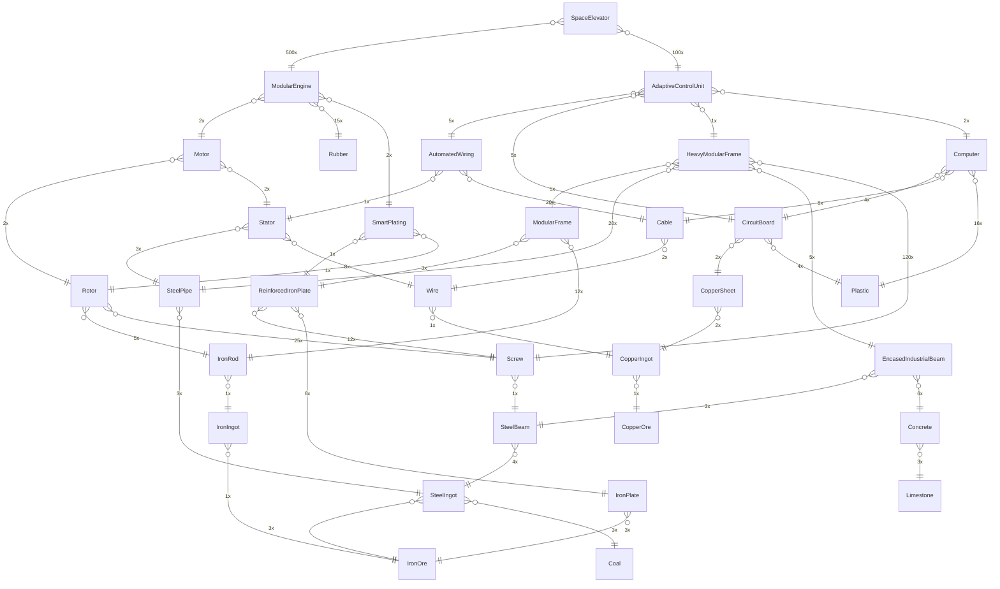

```mermaid
erDiagram
  SpaceElevator {}
  
  ModularEngine {}
    Motor {}
      Rotor {}
        IronRod {}
          IronIngot {}
            IronOre {}
        Screw {}
          SteelBeam {}
            SteelIngot {}
              Coal {}
      Stator {}
        SteelPipe {}
        Wire {}
          CopperIngot {}
            CopperOre {}
    Rubber {}
    SmartPlating{}
      ReinforcedIronPlate {}
        IronPlate {}

  AdaptiveControlUnit {}
    AutomatedWiring {}
      Cable {}
    CircuitBoard {}
      CopperSheet {}
      Plastic {}
    HeavyModularFrame {}
      ModularFrame {}
      EncasedIndustrialBeam {}
        Concrete {}
          Limestone {}
    Computer {}

  SpaceElevator }o--|| ModularEngine : "500x"
  SpaceElevator }o--|| AdaptiveControlUnit : "100x"
    ModularEngine }o--|| Motor : "2x"
      Motor }o--|| Rotor : "2x"
        Rotor }o--|| IronRod : "5x"
          IronRod }o--|| IronIngot : "1x"
            IronIngot }o--|| IronOre : "1x"
        Rotor }o--|| Screw : "25x"
          Screw }o--|| SteelBeam : "1x"
            SteelBeam }o--|| SteelIngot : "4x"
              SteelIngot }o--|| IronOre : "3x"
              SteelIngot }o--|| Coal : "3x"
      Motor }o--|| Stator : "2x"
        Stator }o--|| SteelPipe : "3x"
          SteelPipe }o--|| SteelIngot : "3x"
        Stator }o--|| Wire : "8x"
          Wire }o--|| CopperIngot : "1x"
            CopperIngot }o--|| CopperOre : "1x"
    ModularEngine }o--|| Rubber : "15x"
    ModularEngine }o--|| SmartPlating : "2x"
      SmartPlating }o--|| ReinforcedIronPlate : "1x"
        ReinforcedIronPlate }o--|| Screw : "12x"
        ReinforcedIronPlate }o--|| IronPlate : "6x"
          IronPlate }o--|| IronOre : "3x"
      SmartPlating }o--|| Rotor : "1x"
    AdaptiveControlUnit }o--|| AutomatedWiring : "5x"
      AutomatedWiring }o--|| Stator : "1x"
      AutomatedWiring }o--|| Cable : "20x"
        Cable }o--|| Wire : "2x"
    AdaptiveControlUnit }o--|| CircuitBoard : "5x"
      CircuitBoard }o--|| CopperSheet : "2x"
        CopperSheet }o--|| CopperIngot : "2x"
      CircuitBoard }o--|| Plastic : "4x"
    AdaptiveControlUnit }o--|| HeavyModularFrame : "1x"
      HeavyModularFrame }o--|| ModularFrame : "5x"
        ModularFrame }o--|| ReinforcedIronPlate : "3x"
        ModularFrame }o--|| IronRod : "12x"
      HeavyModularFrame }o--|| SteelPipe : "20x"
      HeavyModularFrame }o--|| EncasedIndustrialBeam : "5x"
        EncasedIndustrialBeam }o--|| SteelBeam : "3x"
        EncasedIndustrialBeam }o--|| Concrete : "6x"
          Concrete }o--|| Limestone : "3x"
      HeavyModularFrame }o--|| Screw : "120x"
    AdaptiveControlUnit }o--|| Computer : "2x"
      Computer }o--|| CircuitBoard : "4x"
      Computer }o--|| Cable : "8x"
      Computer }o--|| Plastic : "16x"
```
